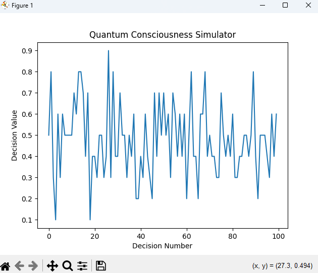
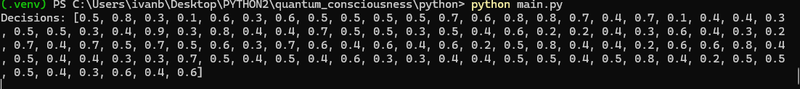

# Quantum Inspired Consciousness Simulator

## Overview
A Rust/Python implementation of a quantum-inspired neural network based on **Orch-OR (Orchestrated Objective Reduction) theory**.  
Simulates probabilistic neuron behavior and emergent network-level "decisions" through quantum collapse mechanics.

**What is Orch-OR?**  

**Orchestrated Objective Reduction (Orch-OR)** is a controversial but influential theory of consciousness originally proposed in the 1990s by:

**Sir Roger Penrose** (Nobel Prize-winning physicist, University of Oxford)

**Dr. Stuart Hameroff** (anesthesiologist, University of Arizona)

The theory suggests that:

1. **Microtubules** (protein structures in brain neurons) act as quantum computers.

2. **Quantum superposition** occurs within microtubules at tiny scales (~10⁻⁸ meters).

3. **Objective reduction** (wavefunction collapse) produces moments of conscious experience.

    -  Unlike standard quantum mechanics where collapse is random, Orch-OR proposes collapses are orchestrated by microtubule processes.

    -  Each collapse corresponds to a "conscious event" (~40 per second, matching gamma EEG waves).

**This project models two key aspects of Orch-OR:**

**Quantum superposition:** Neurons maintain probabilistic states (state: f64 in quantum_neuron.rs).

**Objective reduction:** The observe() method forces collapses to classical states (0 or 1), analogous to microtubule decoherence.

Criticism & Status: While mainstream neuroscience remains skeptical due to lack of empirical evidence, Orch-OR has inspired computational models like this one to explore quantum consciousness hypotheses.

**Key Differences from Classical Models**  
| Feature       | Classical Neurons           | Quantum-Inspired Neurons      |
|--------------|----------------------------|------------------------------|
| State        | Binary (0/1)                | Probabilistic (0.0–1.0)       |
| Collapse     | Deterministic               | Stochastic (Rust `rand` crate)|
| Entanglement | Not applicable              | Future implementation target  |

## Features
- **Quantum Neuron Core**: Simulates superposition/collapse (`quantum_neuron.rs`).
- **Network Dynamics**: Aggregates neuron states into "conscious decisions" (`quantum_network.rs`).
- **Cross-Language Workflow**: Rust backend for performance + Python frontend for visualization.
- **CLI & Visual Modes**: Terminal output (`cli.rs`) and Matplotlib graphs (`main.py`).

## Goals
1. **Test Orch-OR computationally** using quantum-inspired algorithms.
2. **Demonstrate emergent complexity** from simple probabilistic rules.
3. **Bridge neuroscience and quantum computation** in an accessible way.

## Prerequisites
- **Rust**: `curl --proto '=https' --tlsv1.2 -sSf https://sh.rustup.rs | sh`
- **Python 3.8+**: `python -m venv .venv`
- **Dependencies**:  
  ```powershell
  pip install matplotlib pyo3

## Installation

### Step 1: Clone the Repository

Clone this repository to your local machine:

``` bash
git clone https://github.com/danbassov/Quantum-Inspired-Consciousness-Simulator.git
cd Quantum-Inspired-Consciousness-Simulator
```

### Step 2: Build Rust Components

```powershell
cargo build --release
copy .\target\release\quantum_consciousness.dll .\python\quantum_consciousness.pyd
```

### Step 3: Run the Simulation

```powershell
.\.venv\Scripts\Activate
cd python
python main.py
```

## Output Visualization:

*Figure 1: Emergent decision patterns from a 10-neuron quantum network over 100 timesteps.  
Each point represents the network's average activation (0.0-1.0) after quantum state collapse,  
simulating Orch-OR's proposed consciousness mechanism.*


*Figure 2: Command-line output showing a single quantum network decision (0.6).  
This value represents 6 of 10 neurons collapsing to |1⟩ states during observation,  
with randomness governed by probabilistic superposition.*


## How it Works:

### 1. Core Components
- **Quantum Neurons** (`quantum_neuron.rs`):  
  Simulate probabilistic state collapse using Rust's `rand` crate, with each neuron maintaining a superposition probability (`state: f64`) until observation.

- **Neural Network** (`quantum_network.rs`):  
  Aggregates neuron states through a weighted average (`decide()` method), producing emergent network-level behavior from individual collapses.

### 2. Cross-Language Architecture
- **Rust Backend**: Handles high-performance quantum simulation logic.  
- **Python Frontend**: Provides visualization via `matplotlib`, interfacing with Rust through `pyo3` bindings.  
- **CLI Interface** (`cli.rs`): Offers terminal-based execution for rapid testing.  

### 3. Data Flow
1. Neurons initialize in superposition (e.g., `state: 0.5`)  
2. Network triggers synchronous observation (`observe()`)  
3. Collapsed states aggregate into a decision value (`0.0` to `1.0`)  
4. Results propagate to either:  
   - Python for graphical output  
   - Terminal via CLI  

### 4. Key Technical Choices
| Component           | Rationale                                                                 |
|---------------------|---------------------------------------------------------------------------|
| `f64` probabilities | Balances accuracy with computational efficiency                           |
| `pyo3` bindings     | Enables zero-copy data transfer between Rust/Python                       |
| Modular design      | Separates quantum logic (Rust) from presentation (Python) for maintainability |

## Usage

### Python API

This API allows users to import the Rust code as a Python library.

```python
import quantum_consciousness
network = quantum_consciousness.PyQuantumNeuralNetwork(10)
decisions = [network.decide() for _ in range(100)]
```

**How the API connects to the code:**

**1.** Rust → Python Binding (in lib.rs):

```rust
#[pyclass]
pub struct PyQuantumNeuralNetwork {
    network: QuantumNeuralNetwork,  // Your Rust network
}

#[pymethods]
impl PyQuantumNeuralNetwork {
    #[new]
    fn new(num_neurons: usize) -> Self { ... }  // Constructor
    fn decide(&mut self) -> f64 { ... }  // The 'decide' method
}
```

**2.**Underlying Logic (in quantum_network.rs):

```rust
pub fn decide(&mut self) -> f64 {
    let sum: u8 = self.neurons.iter_mut()
        .map(|neuron| neuron.observe())  // Quantum collapse
        .sum();
    sum as f64 / self.neurons.len() as f64  // Normalized average
}
```

## Tech Stack

**Backend:** Rust (rand,pyo3)

**Visualization:** Python (matplotlib)

**Interop**: pyo3

## Future Improvements

Replace classical probabilities (`state: f64`) with **complex-numbered quantum states** for scientific accuracy

Quantum entanglement between neurons

GUI Dashboard

Performance benchmarks

## Contribution Guidelines:

**1.** Fork the repository

**2.** Create new branch

**git checkout -b branch_name**

**3.** Commit changes and push to forked repository

**4.** Submit pull request with description of changes

## License

This project is licensed under the MIT License.

  
